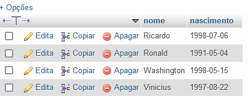
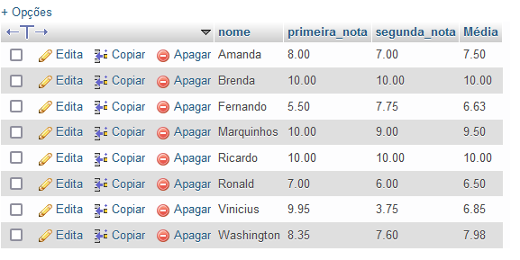
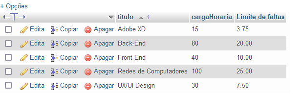
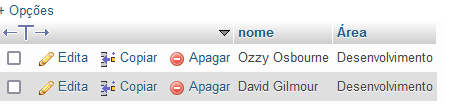
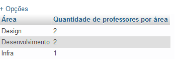
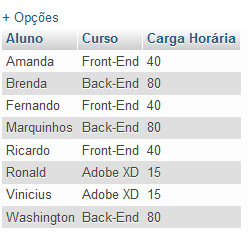
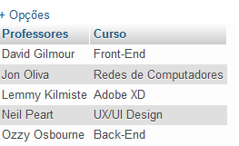
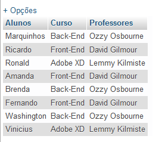
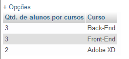
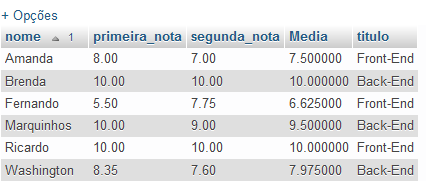

## Comandos de consulta 

```sql
-- 1)Para consulta de alunos que nasceram antes de data x (usei 2001 porque na minha tabela não há ninguém que nasceu antes em 2009)
SELECT nome, nascimento FROM alunos WHERE nascimento < '2001-01-01';
```

```sql
-- 2)Consulta que demonstra média de cada aluno com duas casas decimais
SELECT nome, primeira_nota, segunda_nota, ROUND(AVG(primeira_nota + segunda_nota)/2,2) AS Média FROM alunos GROUP BY nome;
```


```sql
-- 3)Consulta de limite de faltas de cada curso de acordo com carga horária. Considerando o limite de como 25%. Ordenado pelo titulo do curso
SELECT titulo, cargaHoraria, (cargaHoraria*0.25) AS 'Limite de faltas' from cursos ORDER BY cursos.titulo;
```


```sql
-- 4) Consulta para identificar nome de professores da área de desenvolvimento

SELECT nome, area_de_atuacao AS Área FROM professores WHERE area_de_atuacao = 'Desenvolvimento';
```



```sql
-- 5) Consulta que mostra a quantidade de professores por área de atuação
SELECT area_de_atuacao AS Área, COUNT(area_de_atuacao) AS 'Quantidade de professores por área' FROM professores GROUP BY area_de_atuacao;
```


```sql
-- 6) Consulta que mostra o nome dos alunos, o curso e a carga horária do curso
SELECT alunos.nome AS Aluno, cursos.titulo AS Curso, cursos.cargaHoraria AS 'Carga Horária' FROM alunos INNER JOIN cursos ON alunos.cursos_id = cursos.id ORDER BY alunos.nome;
```


```sql
-- 7) Consulta do nome do professor e o titulo do curso classificado pelo nome do professor
SELECT professores.nome AS Professores, cursos.titulo AS Curso FROM professores INNER JOIN cursos ON professores.cursos_id = cursos.id ORDER BY professores.nome;
```



```sql
-- 8) Consulta que mostra o nome dos alunos, titulo do cursos e o nome dos respectivos professoes
SELECT alunos.nome AS Alunos, cursos.titulo AS Curso, professores.nome AS Professores FROM alunos INNER JOIN cursos ON alunos.cursos_id = cursos.id INNER JOIN professores ON professores.cursos_id = cursos.id;
```


```sql
-- 9) Consulta que mostra quantidade de alunos que cada curso possui, classificando o resultado em ordem descrescente
SELECT COUNT(alunos.cursos_id) AS 'Qtd. de alunos por cursos', cursos.titulo AS Curso FROM alunos INNER JOIN cursos ON alunos.cursos_id = cursos.id GROUP BY cursos.titulo ORDER BY COUNT(alunos.cursos_id)DESC;
```


```sql
-- 10) Faça consulta que mostre dos alunos, suas notas médias, e o título dos cursos que fazem. Considerando os alunos front e back end, classificando pelo nome do aluno
SELECT nome, primeira_nota, segunda_nota, (primeira_nota+segunda_nota)/2 AS Media, cursos.titulo FROM alunos INNER JOIN cursos ON alunos.cursos_id = cursos.id WHERE alunos.cursos_id = 12 OR alunos.cursos_id = 11 ORDER BY nome;
```


```sql
-- 11) Alterado o Figma para adobe xd
UPDATE cursos SET titulo = 'Adobe XD' WHERE titulo = 'Figma';
-- Alterando a carga horária de 10h à 15h
UPDATE cursos SET cargaHoraria = 15 WHERE cargaHoraria = 10;

-- 12) DELETE de um aluno do curso de UX e de REDES de computadores.
DELETE FROM alunos WHERE cursos_id = 13 AND nome = 'Leonardo'; 
DELETE FROM alunos WHERE cursos_id = 15;
```
```sql
-- 13) Consulta que mostre a lista de alunos atualizada e o título dos cursos que fazem, classificados pelo nome do aluno
SELECT alunos.nome AS Alunos, cursos.titulo AS Cursos FROM alunos INNER JOIN cursos ON alunos.cursos_id = cursos.id ORDER BY alunos.nome;


--  Desafio 1) Consulta que calcula a idade do aluno
SELECT nome AS Nome, TIMESTAMPDIFF(YEAR, nascimento, curdate()) AS Idade FROM alunos;

-- Desafio 2) Consulta que mostra média de cada aluno quando for maior que 7
SELECT nome, primeira_nota, segunda_nota, (primeira_nota+segunda_nota)/2 AS Média FROM alunos WHERE (primeira_nota+segunda_nota)/2 >= 7;

-- Desafio 3) Média menor que 7
SELECT nome, primeira_nota, segunda_nota, (primeira_nota+segunda_nota)/2 AS Média FROM alunos WHERE (primeira_nota+segunda_nota)/2 < 7;

-- Desafio 4 
SELECT COUNT((primeira_nota+segunda_nota)/2) AS 'Qtd de alunos com média acima ou igual à 7' FROM alunos WHERE (primeira_nota+segunda_nota)/2 >= 7;
```

